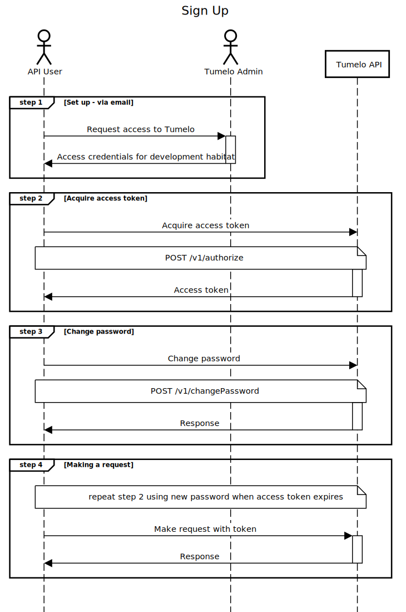

# Getting Started

## Overview

This guide explains how to get access to the Tumelo Platform API and to how start using the API to give investors a deeper understanding of which companies they are ultimately invested in through their pension or other investment product. We refer to this as giving users *transparency* over their investments. For a further explanation of what we mean by transparency, please see the [What is Transparency](../What_is_Transparency/README.md) guide.

## Pre-requisites

* None

## Definitions

* **Customer**: A company who is using the Tumelo Platform to provide transparency and/or other shareholder engagement features to their end users. As a developer reading this guide, the customer is the company you are working for to integrate the Tumelo API into their web site or mobile app.
* **Investor**: The end-user of a customer's website or mobile app who holds some kind of equity-based investment product. The investor will have access to Tumelo's platform transparency and/or other shareholder engagement features once the Tumelo API has been integrated with the customer's digital platform.
* **Habitat**: A customer-specific slice of the Tumelo platform. This is where all the information that is private to a customer is managed, for example investor account details.
* **Instrument**: Any tradable investment instrument such as a share, bond or fund that forms part of an investment portfolio. We refer to a fund or other tradable instrument that is itself made up of other instruments as a ***composite instrument***.
* **Subscribed Instruments:** The instruments that a customer can perform transparency-related operations on, for example obtaining an organization breakdown.

## Process Flow

### Step 1 - Requesting Access

Request access to the Tumelo platform by emailing [support@tumelo.com](mailto:support@tumelo.com). In order to set up your access, we will require some basic information including:

* Your company name
* A technical contact email address
* A technical contact phone number
* A list of the instruments that make up the top-level holdings of your end-user investors, identified by their ISIN. This is your list of **subscribed instruments**. You do not need to worry about including instruments that are held by the top-level instruments. That's where Tumelo helps out. You just give us the starting funds, and we do all the hard work of working out what's in them for you and your users.

We will provide you with the following information relating to your newly created API user account:

* Username
* Temporary password
* The ID of a habitat unique to your company that is suitable for developing and testing your solution against. When you are ready to move to production, we will issue you an additional habitat ID for production use.
* Authentication provider details
* Your habitat will include a selection of common instruments suitable for your initial development activities. We will inform you when the list of instruments you requested are also available for use in your test habitat.

### Step 2 - Changing Password

The first time you access the API, the temporary password must be changed for a strong password set by you. A detailed explanation of this one-time process is given in the API reference guide [First time sign up](https://docs.tumelo.com/#section/Access/Authentication).

Now you have set a strong password on your API user account you're ready to start making API requests!

### Step 3 - Using the API

Use the credentials supplied by Tumelo in conjunction with the strong password you set in Step 2 in order to obtain an authorisation token for subsequent requests.

The API user credentials we supply provide access to all the data within your specific habitat. This API user should be thought of as a service account rather than representing a single end-user or a single developer. Each API user account has access to a single habitat, and all developers working for the same company use the same API user account to access the company's habitat.

## Sequence Diagram

