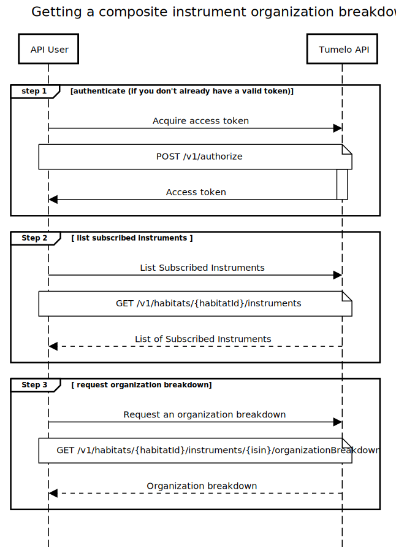

# Instrument Transparency

## Overview

This guide explains how to obtain an organization breakdown of a fund or other *composite instrument* in order to provide detailed information about all the companies invested in either directly or indirectly through that instrument. For an overview of organization breakdowns, see the [What is Transparency](../What_is_Transparency/README.md) guide.

The composite instrument's organization breakdown allows you to know exactly how the instrument's own investments are distributed across many companies. The breakdown also provides useful information about each organization such as its name, logo and short bio.

In order to get an organization breakdown on a specific composite instrument your company must have included the instrument in your subscribed instruments list. To update subscribed instruments, get in touch with us at [support@tumelo.com](mailto:support@tumelo.com).

## Pre-requisites

* Must have signed up with tumelo and obtained the credentials for your service user account (see [Getting Started](../Getting_Started/README.md) for further details)
* You habitat must be subscribed to one or more composite instruments

## Definitions

* **Composite instrument**: A composite instrument will be invested into other instruments, such as shares, bonds or even other composite instruments. There are many types of composite instruments (mutual, OEIC, ETFs…) but all have this basic structure.

### Subscribed instruments

When you set up access to Tumelo's API, you tell us which funds you would like to be able to get organization breakdowns for (see Getting Started). We refer to these as your [Subscribed Instruments](https://docs.tumelo.com/#section/Subscribed-Instruments). You may request an organization breakdown on any composite instrument that appears in your subscribed instrument list.

## API Request Flow

### Step 1

Authenticate with the tumelo system

### Step 2

List the instruments in your habitat that are available for requesting an organization breakdown on. This is to find the ISINs of the instruments in your subscribed instrument list and to check which of your subscribed instruments are composite. 

| Tumelo API Documentation Link | [List subscribed instruments](https://docs.tumelo.com/#section/Subscribed-Instruments) |
|-------------------------------|----------------------------------------------------------------------------------------|

### Step 3

Get the organization breakdown for a composite instrument.

The output of this step will provide the organizations in which the composite instrument is invested.  Each organization in the breakdown is given a weighting indicating the relative investment ownership within the composite instrument. If you request an organization breakdown on a non-composite instrument from your subscribed list, the API will return an error.

| Tumelo API Documentation Link | [Get organization breakdown for a composite instrument](https://docs.tumelo.com/#operation/getOrganizationBreakdownByIsinInHabitat) |
|-------------------------------|-------------------------------------------------------------------------------------------------------------------------------------|

## Sequence Diagram



## Code Example

In the following example, we assume you have completed the steps in the Getting Started guide to change your API User's temporary password. The example illustrates how to obtain an ID token from AWS Cognito using their HTTP API in order to provide the authentication credentials required by the Tumelo API, however in practice we recommend the use of one of the Cognito client libraries which make obtaining and refreshing tokens straightforward. For further details see the [Authentication](../Authetication/README.md) guide.

#### cURL

Getting the ID token (step 1). This is normally done automatically through a suitable Cognito client library.

```shell
cat <<EOF > tumelo-api-auth.json
{
 "AuthParameters" : {
   "USERNAME" : "{YOUR_USERNAME}",
   "PASSWORD" : "{YOUR_PASSWORD}"
 },
 "AuthFlow" : "USER_PASSWORD_AUTH",
 "ClientId" : "{CLIENT_ID}"
}
EOF

ID_TOKEN=$(curl -X POST --data @tumelo-api-auth.json -s \
	-H "X-Amz-Target: AWSCognitoIdentityProviderService.InitiateAuth" \
	-H "Content-Type: application/x-amz-json-1.1" \
	https://cognito-idp.eu-west-2.amazonaws.com/ | jq -r ".AuthenticationResult.IdToken")
```

Listing your subscribed instruments (step 2).

```shell
export HABITAT_ID={your habitat here}

curl --location --request \
	GET 'https://api.prod.tumelo.com/v1/habitats/'$HABITAT_ID'/instruments' \
    --header 'Authorization: Bearer '$ID_TOKEN
```

Getting the organization breakdown (step 3).

```shell
export HABITAT_ID={your habitat here}
export ISIN={chosen ISIN here}

curl --location --request \
	GET 'https://api.prod.tumelo.com/v1/habitats/'$HABITAT_ID'/instruments/'$ISIN'/organizationBreakdown' \
    --header 'Authorization: Bearer '$ID_TOKEN
```

## Example Breakdown Response

```json
{
    "basedOn": {
        "instruments": [
            {
                "instrument": {
                    "isin": "GB00B7VT0938"
                },
                "validAt": "2019-12-19T10:27:12.234Z"
            },
        ]
    },
    "components": {
        "cash": [
            {
                "currency": "GBP",
                "weight": 0.375
            }
        ],
        "organizations": [
            {
                "organization": {
                    "bio": {
                        "description": "GVC Holdings PLC is a British sports betting and gambling company. It is listed on the London Stock Exchange and is a constituent of the FTSE 250 Index.",
                        "source": "wikipedia",
                        "sourceUrl": "https://en.wikipedia.org/wiki/GVC_Holdings"
                    },
                    "displayName": "GVC Holdings",
                    "externalIdentifiers": [
                        "LEI_213800GNI3K45LQR8L28"
                    ],
                    "id": "9d6cc93b-a612-47b4-947c-5a998dd6292c",
                    "legalName": "GVC Holdings PLC",
                    "websiteUrl": "http://www.gvc-plc.com/"
                },
                "weight": 0.25
            },
            {
                "organization": {
                    "bio": {
                        "description": "Just Eat plc is a British online food order and delivery service. It acts as an intermediary between independent take-out food outlets and customers. ",
                        "source": "wikipedia",
                        "sourceUrl": "https://en.wikipedia.org/wiki/Just_Eat"
                    },
                    "displayName": "Just Eat",
                    "externalIdentifiers": [
                        "LEI_213800DZ8PDXRQBBBM02"
                    ],
                    "id": "547c51f2-dd72-43d7-8585-928daccff854",
                    "legalName": "Just Eat PLC",
                    "logoUrl": "https://res.cloudinary.com/tumelo-dev/image/upload/w_128,h_128,c_fit/v1580298377/px0rajkfri1szyedlg1v.png",
                    "websiteUrl": "https://www.justeatplc.com/"
                },
                "weight": 0.25
            },
        ],
        "others": 0.125
    },
    "readTime": "2020-07-23T09:45:35.311128394Z"
}
```