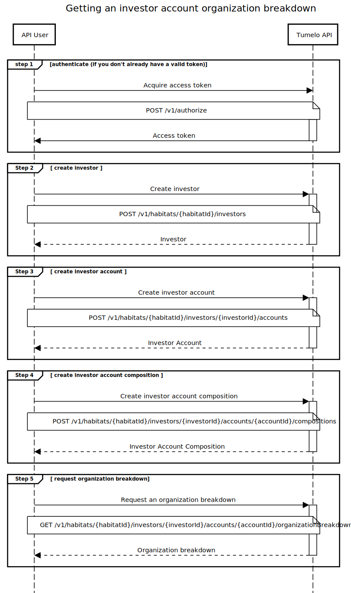

# Investor Account Transparency

## Overview

This guide explains how to obtain an organization breakdown of the holdings within an investor's account. For an overview of organization breakdowns, see the [What is Transparency](../What_is_Transparency/README.md) guide.

The investor account organization breakdown allows you to know exactly how the holdings within an investor's account are distributed across many companies. The breakdown also provides useful information about each organization such as its name, logo and a short bio.

Before you can get the organization breakdown of an investor's account, you must first create an investor and an investor account in Tumelo, and then update the account with the latest holdings information relating to that investor's account. This guide walks you through that process.

If many of your investors share the same portfolio structure, you may find it easier to use a model portfolio rather than create a separate investor account and holdings records for each individual investor. Further information on model portfolios can be found in the [Model Portfolio Transparency](../Model_Portfolio_Transparency/README.md) guide.

## Pre-requisites

* You must have signed up with tumelo and obtained the credentials for your API service user account (see [Getting Started](../Getting_Started/README.md) for further details)
* Your habitat must be subscribed to one or more instruments. These are the top-level instruments that your investors may hold directly through an account. Often top-level instruments are composite (i.e. are made of of other investment instruments themselves), but investor accounts may also directly hold regular shares and cash. For further information on composite instruments, please see the [Instrument Transparency](../Instrument_Transparency/README.md) guide.

## Investors

An investor entity in tumelo represents one of your end-user investors. Many of the features offered by tumelo are highly personalised to the end-user, for example providing a detailed breakdown of a specific investor's holdings or offering voting based on the holdings of a specific investor.

The **investor** entity in Tumelo is very lightweight, consisting as a minimum of just a unique identifier that is used within Tumelo to represent the investor. Personal information about the investor is not required in order to create an investor entity.

In order to make it easier for you to maintain a mapping between tumelo's identifier and your own identifier for the investor, an 'external identifier' may also be associated with the tumelo investor record when creating the investor.

Step 2 describes how to create an investor.

## Investor accounts

Any given investor may hold multiple investment products or accounts. Tumelo uses an **investor account** entity to represent a single account or product held by an investor. Investor accounts are also very lightweight entities. They may optionally be assigned an external identifier and a title if required. 

Step 3 describes how to create an investor account.

## Investor account compositions

When it is first created, an investor account is empty. It order to create a record of the holdings within an account, you must create an **investor account composition**. Each composition is a snapshot in time of the investment instruments (and cash if relevant) held in the account, including the relative value of each holding as a proportion of the total account value. We refer to this as the **weight** of each holding.

In order to keep the holdings information for each investor up to date, it is a good idea to create a new account composition either on a scheduled basis, or if the number of units held in any given instrument changes. It is generally not necessary to create new composition records just to account for relative changes in the daily price fluctuations in the holdings.

Step 4 describes how to create an account composition record.

## Tumelo API Request Flow

### Step 1 - Authenticate

Authenticate with the Tumelo API

### Step 2 - Create an Investor

Create an investor in Tumelo. The response will contain the Tumelo's unique identifier for investor.

| Tumelo API Documentation Link | [Create investor](https://docs.tumelo.com/#operation/createInvestor)                  |
|-------------------------------|---------------------------------------------------------------------------------------|

### Step 3 - Create an Investor Account

Using the Tumelo identifier returned in the previous step, create an investor account. The response will contain Tumelo's unique identifier for the account.

| Tumelo API Documentation Link | [Create investor account](https://docs.tumelo.com/#operation/createInvestorAccount) |
|-------------------------------|-------------------------------------------------------------------------------------|

### Step 4 - Create an Investor Account Composition

Using the Tumelo investor identifier returned in the previous step, create an investor account. The response will contain Tumelo's unique identifier for the account.

Note that the instruments included in the account composition details must all be subscribed instruments within your habitat.

| Tumelo API Documentation Link | [Create investor account composition](https://docs.tumelo.com/#operation/createInvestorAccountComposition) |
|-------------------------------|------------------------------------------------------------------------------------------------------------|

### Step 5 - Get Organization Breakdown

Using the investor account identifier returned in Step 3, get the organization breakdown for an investor account

The output of this step will provide the organizations in which the investor account is invested based on the account composition with the most recent `validTime`. Each organization in the breakdown is given a weighting indicating the relative investment ownership within the investor account

| Tumelo API Documentation Link | [Get organization breakdown for investor account](https://docs.tumelo.com/#operation/getInvestorAccountOrganizationBreakdown) |
|-------------------------------|-------------------------------------------------------------------------------------------------------------------------------|

### Sequence Diagram



## Code Example

In the following example, we assume you have completed the steps in the [Getting Started](../Getting_Started/README.md) guide to change your API User's temporary password. The example illustrates how to obtain an ID token from AWS Cognito using their HTTP API in order to provide the authentication credentials required by the Tumelo API, however in practice we recommend the use of one of the Cognito client libraries which make obtaining and refreshing tokens straightforward. For further details see the Authentication guide.

### cURL

### Step 1 - Getting the ID token

This is normally done automatically through a suitable Cognito client library.

```shell
cat <<EOF > tumelo-api-auth.json
{
 "AuthParameters" : {
   "USERNAME" : "{YOUR_USERNAME}",
   "PASSWORD" : "{YOUR_PASSWORD}"
 },
 "AuthFlow" : "USER_PASSWORD_AUTH",
 "ClientId" : "{CLIENT_ID}"
}
EOF

ID_TOKEN=$(curl -X POST --data @tumelo-api-auth.json -s \
	-H "X-Amz-Target: AWSCognitoIdentityProviderService.InitiateAuth" \
	-H "Content-Type: application/x-amz-json-1.1" \
	https://cognito-idp.eu-west-2.amazonaws.com/ | jq -r ".AuthenticationResult.IdToken")
```

### Step 2 - Create Investor

In this example, we're creating an investor on the Tumelo Platform corresponding to the investor on the provider's platform with an identifier value of `PROVIDER_INVESTOR_ID`

```shell
export HABITAT_ID={your habitat here}

curl --location --request \
    POST 'https://api.prod.tumelo.com/v1/habitats/'$HABITAT_ID'/investors' \
    --header 'Authorization: Bearer '$ID_TOKEN \
    --header 'Content-Type: application/json' \
    --data-raw '{
	    "externalId": "PROVIDER_INVESTOR_ID"
    }'
```

The above request will return a response that includes the tumelo `id` of the newly created investor resource, similar to the following:

```json
{
  "externalId":"PROVIDER_INVESTOR_ID",
  "id":"d170c48f-a2d3-45ec-8c7a-a542c9fc839f"
}
```

### Step 3 - Create Investor Account

In this example, we're creating an investor account on the Tumelo Platform corresponding to the investor account on the provider's platform with an identifier value of `PROVIDER_ACCOUNT_ID` and an (optional) title of 'Example account title'

```shell
export INVESTOR_ID={investor id returned in Step 2}

curl --location --request POST 'https://api.prod.tumelo.com/v1/habitats/'$HABITAT_ID'/investors/'$INVESTOR_ID'/accounts' \
--header 'Content-Type: application/json' \
--header 'Authorization: Bearer '$ID_TOKEN \
--data-raw '{
	"externalId": "PROVIDER_ACCOUNT_ID",
    "title": "Example account title"
}'
```

The above request will return a response that includes the tumelo `id` of the newly created investor account resource, similar to the following:

```json
{
  "externalId":"PROVIDER_ACCOUNT_ID",
  "id":"68ce31de-831c-4d90-b1e7-e84e36ed583f",
  "title":"Example account title"
}
```

### Step 4 - Define account holdings

In this example we will create a very simple account composition to illustrate the process. 

The composition will consist of 25% Apple shares (ISIN US0378331005), 75% iShares FTSE 100 ETF (ISIN IE0005042456). The `validTime` is the time at which the composition is considered to be accurate (i.e. the valuation time).

***Note the instruments, values and number of units in this example are for the purposes of illustration only. They are not intended to represent realistic valuations and do not constitute any kind of investment advice or recommendation.***

```shell
export ACCOUNT_ID={account id returned in Step 3}

curl --location --request POST 'https://api.prod.tumelo.com/v1/habitats/'$HABITAT_ID'/investors/'$INVESTOR_ID'/accounts/'$ACCOUNT_ID'/compositions' \
--header 'Content-Type: application/json' \
--header 'Accept: application/json' \
--header 'Authorization: Bearer '$ID_TOKEN \
--data-raw '{
    "validTime":"2020-07-07T15:56:00Z",
    "components":{
        "instruments": [
            {
                "isin": "US0378331005",
                "weight": 0.25,
                "units": 100
            },
            {
                "isin": "IE0005042456",
                "weight": 0.75,
                "units": 42
            }
        ]
    }
}'
```

The response for the above request will resemble the following:

```json
{
    "components": {
        "instruments": [
            {
                "isin": "US0378331005",
                "units": 100,
                "weight": 0.25
            },
            {
                "isin": "IE0005042456",
                "units": 42,
                "weight": 0.75
            }
        ]
    },
    "createTime": "2020-08-03T12:59:07.246794Z",
    "id": "5ab55db7-9f87-4a2e-8a13-0eb0062d0334",
    "validTime": "2020-07-07T15:56:00Z"
}
```

### Step 5 - Getting the account organization breakdown

Now the account's holdings are known, you can request an organization breakdown for the account

```shell
curl --location --request GET 'https://api.prod.tumelo.com/v1/habitats/'$HABITAT_ID'/investors/'$INVESTOR_ID'/accounts/'$ACCOUNT_ID'/organizationBreakdown' \
--header 'Authorization: Bearer '$ID_TOKEN
```

and the response will resemble the following:

```json
{
    "components": {
        "organizations": [
          {
              "organization": {
                  "displayName": "Apple Inc",
                  "externalIdentifiers": ["LEI_HWUPKR0MPOU8FGXBT394"],
                  "id": "46959122-c217-4b82-bc36-845c8f7cb36a",
                  "legalName": "Apple",
                  "logoUrl": "https://res.cloudinary.com/tumelo-dev/image/upload/w_128,h_128,c_fit/v1580298372/cuumzkdemx6zuys2bcxm.png",
                  "websiteUrl": "https://apple.com"
              },
              "weight": 0.25
          },
          {
          	"organizaiton": {
            	"displayName": "Glaxosmithkline Plc",
                ...
            },
            "weight": 0.0013,
          },
          ...
        ]
    },
    "readTime": "2020-08-03T12:59:07.778187493Z"
}
```
