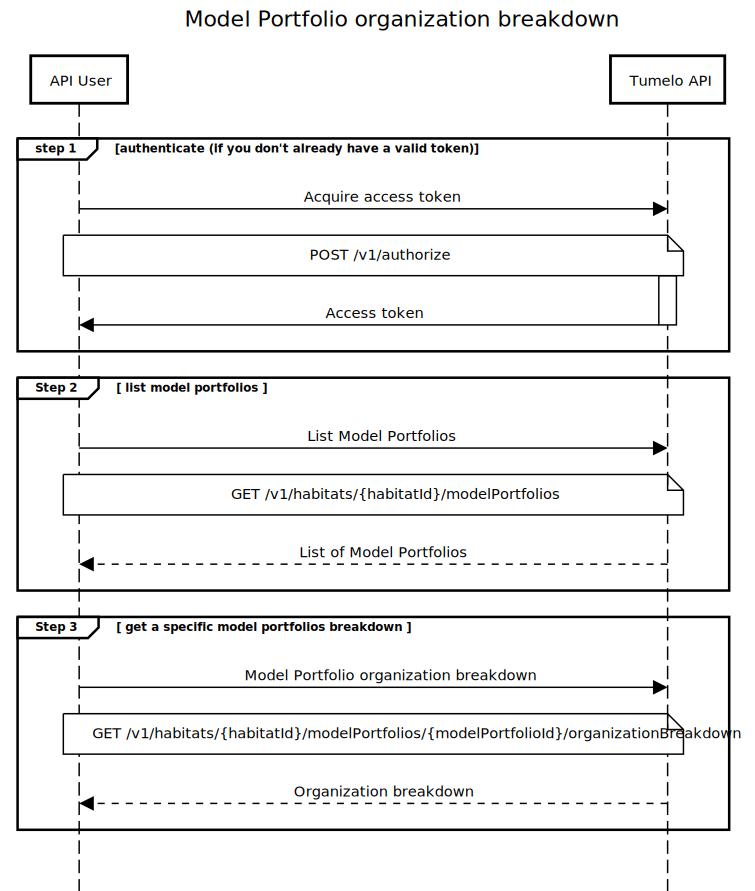

# Model Portfolio Transparency

## Overview

This guide explains how to obtain an organization breakdown of a model portfolio in order to provide detailed information about all the companies invested in either directly or indirectly. For an overview of organization breakdowns, see the [What is Transparency](../What_is_Transparency/README.md) guide.

The model portfolio's organization breakdown allows you to know exactly how the investments are distributed across many companies, and also provides useful information about each organization. 

## Pre-requisites

* Must have signed up with tumelo and obtained the credentials for your service user account (see [Getting Started](../Getting_Started/README.md) for further details)
* Your habitat must include one or more model portfolios. The section below explains how to find out which model portfolios are available in your habitat and how to update them

### Model Portfolios

We've built an easy way to get the organisation breakdown of a group of instruments, which we call a Model Portfolio. Model portfolios are useful when a number of investors have portfolios that are all structured in the same way. Rather than having to create individual investor account compositions for each one, a model portfolio can be used.

In order to have a Model Portfolio set up, please contact [support@tumelo.com](mailto:support@tumelo.com) with a spreadsheet containing the ISINs and their respective % weightings within the Model Portfolio. Model Portfolios can be created in the Tumelo platform with both `title` and `externalId` properties set by you to allow you to identify each Model Portfolio individually. 

Once set up, you can see if they are supported by [listing them](https://docs.tumelo.com/#operation/listModelPortfolios). Once supported, you can get the [organisation breakdown of a Model Portfolio.](https://docs.tumelo.com/#operation/getOrganizationBreakdownByModelPortfolio)

## Tumelo API Request Flow

### Step 1 - Authenticate

Authenticate with the tumelo system

### Step 2 - List Model Portfolios

List the Model Portfolios stored in Tumelo.

This is to extract the internal Tumelo identifiers for each Model Portfolio.  These internal identifiers are required in Step 3.

| Tumelo API Documentation Link | [List model portfolios](https://docs.tumelo.com/#operation/listModelPortfolios) |
|-------------------------------|---------------------------------------------------------------------------------|

### Step 3 - Get Organization Breakdown

Get the organization breakdown for a Model Portfolio.

The Tumelo internal identifier for a Model Portfolio obtained in Step 2 is used to construct the organization breakdown request.

The output of this step will provide the organizations in which the Model Portfolio is invested.  Each organization in the breakdown is given a weighting indicating the relative investment ownership within the Model Portfolio.

| Tumelo API Documentation Link | [Get organization breakdown for a model portfolio](https://docs.tumelo.com/#operation/getOrganizationBreakdownByModelPortfolio) |
|-------------------------------|---------------------------------------------------------------------------------------------------------------------------------|

### Sequence Diagram



## Code Example

In the following example, we assume you have completed the steps in the Getting Started guide to change your API User's temporary password. The example illustrates how to obtain an ID token from AWS Cognito using their HTTP API in order to provide the authentication credentials required by the Tumelo API, however in practice we recommend the use of one of the Cognito client libraries which make obtaining and refreshing tokens straightforward. For further details see the [Authentication](https://docs.tumelo.com/#section/Access/Authentication) section of Tumelo's API documentation.

#### cURL

Getting the ID token (step 1). This is normally done automatically through a suitable Cognito client library.

```shell
cat <<EOF > tumelo-api-auth.json
{
 "AuthParameters" : {
   "USERNAME" : "{YOUR_USERNAME}",
   "PASSWORD" : "{YOUR_PASSWORD}"
 },
 "AuthFlow" : "USER_PASSWORD_AUTH",
 "ClientId" : "{CLIENT_ID}"
}
EOF

ID_TOKEN=$(curl -X POST --data @tumelo-api-auth.json -s \
	-H "X-Amz-Target: AWSCognitoIdentityProviderService.InitiateAuth" \
	-H "Content-Type: application/x-amz-json-1.1" \
	https://cognito-idp.eu-west-2.amazonaws.com/ | jq -r ".AuthenticationResult.IdToken")
```

Listing the model portfolios (step 2). In this example, the ID of the first model portfolio returned is used to set a `MODEL_PORTFOLIO_ID` environment variable.

```shell
export HABITAT_ID={your habitat here}

MODEL_PORTFOLIO_ID=$(curl --location --request \
	GET 'https://api.dev.tumelo.com/v1/habitats/'$HABITAT_ID'/modelPortfolios' \
	--header 'Authorization: Bearer '$ID_TOKEN | jq -r '.modelPortfolios[0].id' )
```

Getting the organization breakdown (step 3).

```shell
curl --location --request \
	GET 'https://api.dev.tumelo.com/v1/habitats/'$HABITAT_ID'/modelPortfolios/'$MODEL_PORTFOLIO_ID'/organizationBreakdown' \
	--header 'Authorization: Bearer '$ID_TOKEN
```

## Example Response

```json
{
    "basedOn": {
        "instruments": [
            {
                "instrument": {
                    "isin": "GB00B7VT0938"
                },
                "validAt": "2019-12-19T10:27:12.234Z"
            },
        ]
    },
    "components": {
        "cash": [
            {
                "currency": "GBP",
                "weight": 0.375
            }
        ],
        "organizations": [
            {
                "organization": {
                    "bio": {
                        "description": "GVC Holdings PLC is a British sports betting and gambling company. It is listed on the London Stock Exchange and is a constituent of the FTSE 250 Index.",
                        "source": "wikipedia",
                        "sourceUrl": "https://en.wikipedia.org/wiki/GVC_Holdings"
                    },
                    "displayName": "GVC Holdings",
                    "externalIdentifiers": [
                        "LEI_213800GNI3K45LQR8L28"
                    ],
                    "id": "9d6cc93b-a612-47b4-947c-5a998dd6292c",
                    "legalName": "GVC Holdings PLC",
                    "websiteUrl": "http://www.gvc-plc.com/"
                },
                "weight": 0.25
            },
            {
                "organization": {
                    "bio": {
                        "description": "Just Eat plc is a British online food order and delivery service. It acts as an intermediary between independent take-out food outlets and customers. ",
                        "source": "wikipedia",
                        "sourceUrl": "https://en.wikipedia.org/wiki/Just_Eat"
                    },
                    "displayName": "Just Eat",
                    "externalIdentifiers": [
                        "LEI_213800DZ8PDXRQBBBM02"
                    ],
                    "id": "547c51f2-dd72-43d7-8585-928daccff854",
                    "legalName": "Just Eat PLC",
                    "logoUrl": "https://res.cloudinary.com/tumelo-dev/image/upload/w_128,h_128,c_fit/v1580298377/px0rajkfri1szyedlg1v.png",
                    "websiteUrl": "https://www.justeatplc.com/"
                },
                "weight": 0.25
            },
        ],
        "others": 0.125
    },
    "readTime": "2020-07-23T09:45:35.311128394Z"
}
```
